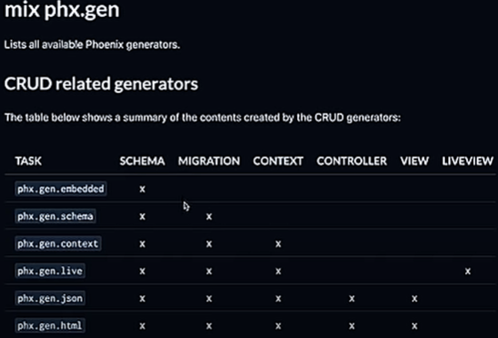

# Shop

To start your Phoenix server:

* Run `mix setup` to install and setup dependencies
* Start Phoenix endpoint with `mix phx.server` or inside IEx with `iex -S mix phx.server`

Now you can visit [`localhost:4000`](http://localhost:4000) from your browser.

Ready to run in production? Please [check our deployment guides](https://hexdocs.pm/phoenix/deployment.html).

## Learn more

* Official website: https://www.phoenixframework.org/
* Guides: https://hexdocs.pm/phoenix/overview.html
* Docs: https://hexdocs.pm/phoenix
* Forum: https://elixirforum.com/c/phoenix-forum
* Source: https://github.com/phoenixframework/phoenix


Theory
[Course](https://www.youtube.com/watch?v=hsYrr1OgQ28&list=PLbV6TI03ZWYXKCJePfD8G34hyWdW_WLFk&index=1&pp=iAQB)
Phoenix crash course #1: Introduction
I really needed one to code one for practice to gain confidence and this course does exactly the same.

We can vertically scale in Phoenix. Vertically scale - Means not multiple servers (i.e. horizontal scaling), In this it’s just one big server which can run multiple processes (isolated)

Phoenix by default uses all the cores if available.

Phoenix is Functional programming and not Object oriented.

If you have LiveView, it means for every user you will have a websocket connection

#### Directory structure
assets = Where your frontend is there
priv/assets - Where your assets are there

> It's an MVC pattern

#### Request Lifecycle
- The endpoint gets the request first. 
- The last part of the endpoint is Router which maps to specific controller and specific action
This is a router e.g. - `get "/" PageController :home`
Here :home is the action

:home - Retrieving the details of one specific product
:index - 
:show - 
:create - 

#### $ mix phx.routes
#### $ mix phx.routes | grep products -> This doesn't work in windows but.


### Latest update of LiveView
#### In new LiveView the ugly syntax <%= val %> is changed to {val}. Wow!
#### On getting latest update of LiveView, do `mix format` to format the codes.

### Ecto Schemas and Migrations
Ecto is the ORM equivalent of the elixir world. Elixir is a functional programming language.
- **Migrations** - Migration is a file which we create to describe changes in the database.
- We are using Phoenix generators 

- Here we will use mix phx.gen.schema which generates both schema and migration
- `mix phx.gen.schema Product products name slug:unique console:enum:pc:xbox:nintendo:playstation`
> Product - name of the module
> products - name of the database

*Note if types are not mentioned like the above name column, it is string by default.*

- **Schema** - It's an Elixir code to link the specific entity of a database.

## Changeset
- 👉 Changeset is a function which runs before we interact with the database.
- I mean it prevents the user from passing any wrong values. I mean a constraint or a validation

```
iex(1)> alias Shop.Product
Shop.Product
iex(2)> Product.changeset(%Product{}, %{name: "Diablo 4"})
#Ecto.Changeset<
  action: nil,
  changes: %{name: "Diablo 4"},
  errors: [
    slug: {"can't be blank", [validation: :required]},
    console: {"can't be blank", [validation: :required]}
  ],
  data: #Shop.Product<>,
  valid?: false,
  ...
>
# iex(3)> changeset = Product.changeset(%Product{}, %{name: "Diablo 4"})
# #Ecto.Changeset<
#   action: nil,
#   changes: %{name: "Diablo 4"},
#   errors: [
#     slug: {"can't be blank", [validation: :required]},
#     console: {"can't be blank", [validation: :required]}
#   ],
#   data: #Shop.Product<>,
#   valid?: false,
#   ...
# >
# iex(4)> changeset.valid?
# false
# iex(5)> changeset.changes
# %{name: "Diablo 4"}
# changeset.changes are the maps which you want to change.
```

### Ecto data persistence
To interact with database, we use `Shop.Repo`
```
iex(7)> Shop.Repo.all(Shop.Product)
[debug] QUERY OK source="products" db=6.9ms decode=6.8ms queue=0.1ms idle=1782.8ms
SELECT p0."id", p0."name", p0."slug", p0."console", p0."inserted_at", p0."updated_at" FROM "products" AS p0 []
↳ :elixir.eval_external_handler/3, at: src/elixir.erl:386
[]

iex(8)> product = %Product{name: "Overwatch 2", slug: "overwatch-2", console: :pc}
%Shop.Product{
  __meta__: #Ecto.Schema.Metadata<:built, "products">,
  id: nil,
  name: "Overwatch 2",
  slug: "overwatch-2",
  console: :pc,
  inserted_at: nil,
  updated_at: nil
}
iex(9)> alias Shop.Repo
Shop.Repo
iex(10)> alias Shop.Product
Shop.Product
iex(11)> Repo.insert(product)
[debug] QUERY OK source="products" db=3.5ms queue=0.1ms idle=1233.6ms
INSERT INTO "products" ("name","console","slug","inserted_at","updated_at") VALUES (?1,?2,?3,?4,?5) RETURNING "id" ["Overwatch 2", :pc, "overwatch-2", ~U[2025-08-13 10:28:14Z], ~U[2025-08-13 10:28:14Z]]
↳ :elixir.eval_external_handler/3, at: src/elixir.erl:386
{:ok,
 %Shop.Product{
   __meta__: #Ecto.Schema.Metadata<:loaded, "products">,
   id: 1,
   name: "Overwatch 2",
   slug: "overwatch-2",
   console: :pc,
   inserted_at: ~U[2025-08-13 10:28:14Z],
   updated_at: ~U[2025-08-13 10:28:14Z]
 }}

iex(12)> Repo.all(Product)
[debug] QUERY OK source="products" db=1.0ms queue=0.1ms idle=1488.9ms
SELECT p0."id", p0."name", p0."slug", p0."console", p0."inserted_at", p0."updated_at" FROM "products" AS p0 []
↳ :elixir.eval_external_handler/3, at: src/elixir.erl:386
[
  %Shop.Product{
    __meta__: #Ecto.Schema.Metadata<:loaded, "products">,
    id: 1,
    name: "Overwatch 2",
    slug: "overwatch-2",
    console: :pc,
    inserted_at: ~U[2025-08-13 10:28:14Z],
    updated_at: ~U[2025-08-13 10:28:14Z]
  }
]
```

#### Work better with changeset rathan than simple struct because it first checks whether you are valid or not.
```
iex(13)> changeset = Product.changeset(%Product{}, %{name: "Diablo 4", console: "xbox"})
#Ecto.Changeset<
  action: nil,
  changes: %{name: "Diablo 4", console: :xbox, slug: "diablo-4"},
  errors: [],
  data: #Shop.Product<>,
  valid?: true,
  ...
>
iex(14)> Repo.insert(changeset)
[debug] QUERY OK source="products" db=1.2ms queue=0.1ms idle=1686.6ms
INSERT INTO "products" ("name","console","slug","inserted_at","updated_at") VALUES (?1,?2,?3,?4,?5) RETURNING "id" ["Diablo 4", :xbox, "diablo-4", ~U[2025-08-13 12:34:16Z], ~U[2025-08-13 12:34:16Z]]
↳ :elixir.eval_external_handler/3, at: src/elixir.erl:386
{:ok,
 %Shop.Product{
   __meta__: #Ecto.Schema.Metadata<:loaded, "products">,
   id: 2,
   name: "Diablo 4",
   slug: "diablo-4",
   console: :xbox,
   inserted_at: ~U[2025-08-13 12:34:16Z],
   updated_at: ~U[2025-08-13 12:34:16Z]
 }}


```

#### To run query clause, you need to import Ecto.Query
```
```


#### Using macros from Ecto.Query
```
iex(3)> query = from p in Product, select: p.slug, where: p.console == ^"pc"
#Ecto.Query<from p0 in Shop.Product, where: p0.console == ^"pc",
 select: p0.slug>
iex(4)> Repo.all(query)
[debug] QUERY OK source="products" db=0.2ms queue=0.2ms idle=1416.1ms
SELECT p0."slug" FROM "products" AS p0 WHERE (p0."console" = ?) [:pc]
↳ :elixir.eval_external_handler/3, at: src/elixir.erl:386
["overwatch-2"]
iex(5)> query = from p in Product, select: p.slug, where: p.console == ^"xbox"
#Ecto.Query<from p0 in Shop.Product, where: p0.console == ^"xbox",
 select: p0.slug>
iex(6)> Repo.all(query)
[debug] QUERY OK source="products" db=0.3ms idle=1135.3ms
SELECT p0."slug" FROM "products" AS p0 WHERE (p0."console" = ?) [:xbox]
↳ :elixir.eval_external_handler/3, at: src/elixir.erl:386
["diablo-4"]
```


### Contexts:
Contexts are just the modules
Contexts are used to isolate the business logic from the ui layer.
> In Phoenix, the UI layer includes the controller also.
> In Phoenix, the web folder (Here, shop_web) should not handle the business logic that is fetching the data from the database etc, but instead to just show/display the fetched data.
> The solution is Context. If you don't know any name make it plural i.e. products.
    That is Just Grab your Schema name and make it plural.
    >> For e-commerce, you can name it Catalog, for users name it Accounts etc

> Another convention in Phoenix, move your schema inside the Context.

### CRUD Generators
`mix phx.gen.context` - This just generates the backend.

**For full stack feature**
`mix phx.gen.html` or `mix phx.gen.json` or `mix phx.gen.live`

`mix phx.gen.context Consoles Console consoles `
- Consoles - It's Context
- Console - It's schema
- consoles - It's database
`mix phx.gen.context Consoles Console consoles name:string price:integer`

`mix ecto.migrate` to migrate and to rollback use `mix ecto.rollback`

We won't migrate this one. 


`mix phx.gen.html Promotions Promotion promotions name:string code:string:unique expires_at:utc_datetime`

#### Using the JSON Generator
`mix phx.gen.json Promotions Promotion promotions name:string code:string:unique`


#### New
`mix phx.new --no-assets --no-html --no-live` Run this to feel like complete backend (a REST API).
No tailwind, esbuild. Made to render json
Even swoosh, liveboard is there, but you may remove


### Authentication
`mix phx.gen.auth Accounts User users`
`mix deps.get`
** Note, it's a generator not a package. Hence, read the comments to know better. Using generators we can customize our own way.
> In test, we do bcrypt of 1 for quick test instead in production which we use the default one i.e. 12.

> redact: true hides the password

> We get another database table user_tokens to store the tokens. By default we use database backed sessions for authentication in phoenix.
This is for security purposes. We can change the password delete all the sessions etc.

- collate is specific to sqlite. It means uppercase or lowercase same email
- In postgres, it's :citext type in email in place of :string.

> user_notifier to send an email to confirm an account.

> swoosh is responsible for sending the email. But not integrated to any mailing services. So We need to manually configure with sendgrid etc.

> In this, we do not prevent the user from using the application if he doesn't confirm his account.
To change this make changes in `require_authenticated_user`
> Go to `dev/mailbox/` 


### Testing
`mix test`

- To run test for specific folder/file
`mix test test/shop`

`mix test test\shop\promotions_test.exs`

- To run that test only
`mix test test\shop\promotions_test.exs:13`

`use ShopWeb.controller, async:true` async true means all the test files will be run in parallel. Note, the test cases inside a file will still run sequentially
> With sqlite, using async:true is not a good advice.


### LiveView
It's the default frontend framework from Phoenix
Contrary to React, LiveView is a server-driven approach to creating highly interactive UIs.

React uses JavaScript and it is primarily used on the client side so you ship a ton of JavaScript to the client and then react mounts and for example whenever there's a state change on the front end then react hydrates the page it updates the page with the new state every time a state changes then the page or the component rerenders now Phenix does the same thing but this is done via a we socket connection and this is triggered by the back end so once you change a state on the front end the back end the server detects this change it does some processing on the back end and then pushes via the websocket `a diff` to the front end then the front end receives this `diff` and patches the DOM

> LiveViews have several important lifecycle stages:
- mount - initializes the LiveView with parameters, session data, and socket
>> ** Think of it as React's useEffect but only run once (i.e. with an empty parameter)

- handle_params - responds to URL changes and updates LiveView state accordingly
- handle_event - responds to user interactions coming from the client
- handle_info - responds to regular process messages

#### Simulating Latency
Note, we are pushing the diff through live view socket.
The LiveView is server driven approach. We handle the state change on the server which means if you deploy on one region (say U.S) and you access it in Brazil, then there will be latency. 
Even on clicking the like/dislike there will be significant latency.

- **To manually change the liveSocket latency do: `liveSocket.enableLatencySim(300)`**

> Hence LiveView is not for simple state change. Sir suggest I used LiveView if any database is involved. And even I used LiveView I would need to make changes in UI to highlight on the client side first and then through server liveView.

- DataCase - For testing contexts
- ConnCase - For testing at higher level i.e. Controller or LiveView

To test LiveView, `import Phoenix.LiveViewTest` in ConnCase